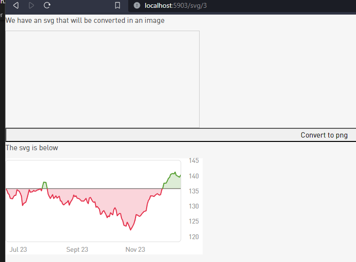

# Crawler
The Crawler downloads some charts and sent it via secure email. 
Used to weekly monitor some stock charts without clicking each single chart.

## How it works
First the program Scraper (scraper/main.go) download the svg file and transform it into a png file.
The result of the Scraper is used by the Crawler to generate the chart email with embedded images.
The email is sent using an Smtp Mail relay over Tls transport.

## Database
The stock list is stored into a sqlite database created with the sql script stockinfo-ref-db.sql.

## Scraper
The Scraper is needed to convert complex svg files with styles into a simple png file, that it is easy to embed inside an email.
The Svg To Png conversion is done using an embedded Web Server that draw the svg inside a canvas with all svg styles embedded and it triggers the download by an automatic button click. The Web Server could also be accessed by within a normal browser with:

    go scraper/main.go -noautofinish
    http://localhost:5903/svg/3   
    
Here 3, at the end of the url, is the image id, for eample for the file chart03.svg inside the static/data folder. 
chart03.svg is created by the scarper when the chart with the id 3 is downloaded.
Urls and ids are stored inside the database into the table stockinfo.

  